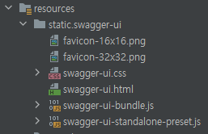
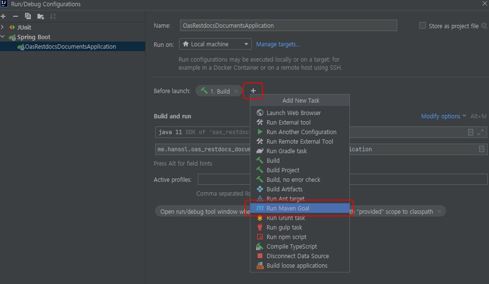
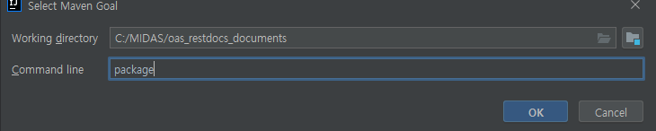
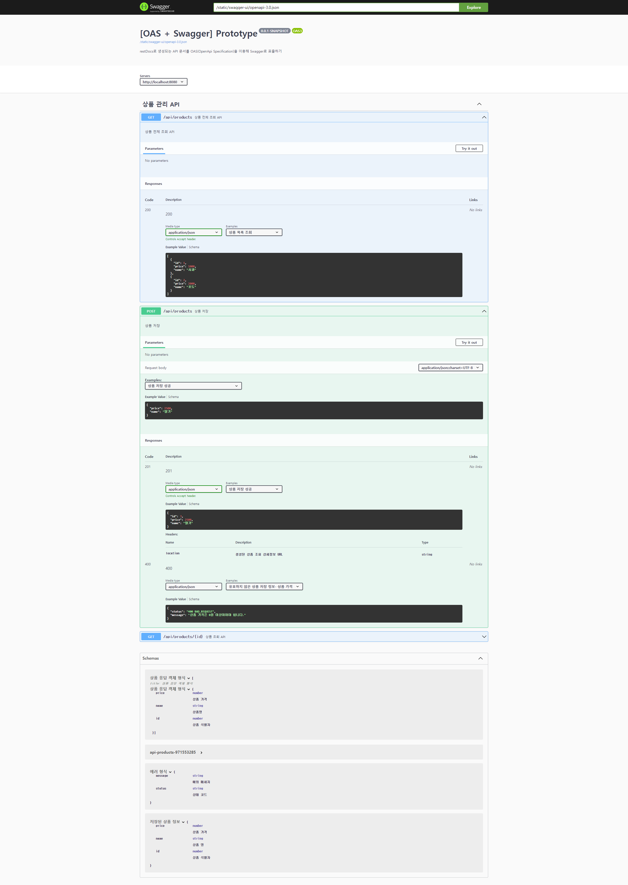

# OpenApiSpecification 을 이용한 문서화 작업 프로젝트
## Swagger + RestDocs

> Web Testing환경을 쉽게 제공하지만, 테스트 안정적이지 못한 Swagger와 테스트 안정적이지만 Web Testing을 할 수 없고,  
> asciidoctor 의 편집이 까다로운 restdocs의 장점을 합쳐 swagger의 Web 환경에서 Restdocs로 생성된 API 가이드를 확인하고 실행까지  
> 시켜볼 수 있도록 하는 프로젝트 


## 1.기존 Swagger, RestDocs 사용 방식과의 구별점

- Swagger dependency 불필요
  - Swagger의 경우 standalone으로 사용할 것이기에 별도의 의존성 필요가 없습니다.


- asciidoctor 를 따로 편집하지 않음
  - 기존 restdocs로 생성되는 문서들을 종합하여 보여주는 asciidoctor 문서를 따로 편집하지 않습니다.  
    추출된 OAS 파일을 Swagger 디렉토리로 복사하여 Swagger환경에서 노출되도록 합니다. 
  
- spring REST Docs 의존성 변경
  - OAS 파일을 만들기 위해 독일 기업 `epage` 에서 만든 오픈소스 프로젝트인 [restdocs-api-spec](https://github.com/ePages-de/restdocs-api-spec)  
    을 사용합니다.

## 2. 구현 방법
구현 방법은 Maven 기준으로 진행하며, 다음과 같습니다. 

### 1. Swagger-UI standalone 세팅
1. 다음 링크[ [link](https://github.com/swagger-api/swagger-ui/releases/latest) ]에서 source를 다운받아   
   `/dist`의 내용을 프로젝트의 `/resources/static/swagger-ui/` 경로에 집어넣도록 한다. 이 때 파일 구성은 다음과 같다.   
      
2. 복사한 파일 중 이름 변경이 필요한 파일 수정과, 불필요한 파일을 제거한다.
   1. `index.html` → `swagger-ui.html` 이름 변경
   2. `index.html` 내부의 js, css경로를 static routing 경로로 변경
   3. SwaggerUIBundle 메서드의 경로는 생성되어 복사 될 파일의 경로로 입력(ex: openapi-3.0.json or openapi-3.0.yaml)
   4. 불필요한 파일 삭제
      1. oauth2-redirect.html
      2. swagger-ui.js
      3. swagger-ui-es-bundle-core.js
      4. swagger-ui-es-bundle.js
3. Static Routing 설정하기 
   ```java
   @Configuration
   public class StaticRoutingConfig implements WebMvcConfigurer {
       @Override
       public void addResourceHandlers(ResourceHandlerRegistry registry) {
           registry.addResourceHandler("/static/**").addResourceLocations("classpath:/static/");
           registry.addResourceHandler("swagger-ui.html").addResourceLocations("classpath:/static/swagger-ui");
       }
   }
   ```
 
### 2. dependency 설정
```xml
<properties>
    <project.build.sourceEncoding>UTF-8</project.build.sourceEncoding>
    <project.reporting.outputEncoding>UTF-8</project.reporting.outputEncoding>

    <asciidoctor.version>2.2.2</asciidoctor.version>
    <restdocs-api-spec.version>0.16.0</restdocs-api-spec.version>
    <restdocs-spec.version>0.21</restdocs-spec.version>
</properties>
```
```xml
<dependency>
    <groupId>com.epages</groupId>
    <artifactId>restdocs-api-spec</artifactId>
    <version>${restdocs-api-spec.version}</version>
    <scope>test</scope>
</dependency>

<dependency>
    <groupId>com.epages</groupId>
    <artifactId>restdocs-api-spec-mockmvc</artifactId>
    <version>${restdocs-api-spec.version}</version>
    <scope>test</scope>
</dependency>
```
```xml
<plugin>
    <groupId>io.github.berkleytechnologyservices</groupId>
    <artifactId>restdocs-spec-maven-plugin</artifactId>
    <version>${restdocs-spec.version}</version>
    <executions>
        <execution>
            <goals>
                <goal>generate</goal>
            </goals>
            <configuration>
                <!--suppress MavenModelInspection -->
                <skip>${skipTests}</skip>
                <specification>OPENAPI_V3</specification>
                <name>[OAS + Swagger] Prototype</name>
                <description>restDocs로 생성되는 API 문서를 OAS(OpenApi Specification)을 이용해 Swagger로 표출하기</description>
                <format>JSON</format>
                <host>localhost:8080</host>
                <outputDirectory>${project.build.directory}/classes/static/swagger-ui/.</outputDirectory>
            </configuration>
        </execution>
    </executions>
</plugin>
```

### 3. 테스트 코드 작성
이제 문서화를 할 테스트를 작성해 줍니다. 
[테스트 케이스 샘플 코드](src/test/java/me/hansol/oas_restdocs_documents/product/ui/ProductApiControllerTest.java)

#### ✔ 참고: 기존 REST Docs로 작성한 코드도 적용하고싶다면? 
> 이 경우 기존 사용하고 있던 Spring의 MockMvcRestDocumentation를 MockMvcRestDocumentationWrapper로 바꿔주면 된다. 

### 4. 실행하기 
#### 4.1 수동으로 Maven command 실행 
> mvn clean package

#### 4.2 IntelliJ Run/Debug Configuration 수정
 
 

### 5. 실행 후 생성된 OAS 확인
> 기본적으로 `target/classes/static/swagger-ui/` 경로에 json혹은 yaml으로 생성된다.
```json
{
  "openapi" : "3.0.1",
  "info" : {
    "title" : "[OAS + Swagger] Prototype",
    "description" : "restDocs로 생성되는 API 문서를 OAS(OpenApi Specification)을 이용해 Swagger로 표출하기",
    "version" : "0.0.1-SNAPSHOT"
  },
  "servers" : [ {
    "url" : "http://localhost:8080"
  } ],
  "tags" : [ ],
  "paths" : {
    "/api/products" : {
      "get" : {
        "tags" : [ "상품 관리 API" ],
        "summary" : "상품 전체 조회 API",
        "description" : "상품 전체 조회 API",
        "operationId" : "상품 목록 조회",
        "responses" : {
          "200" : {
            "description" : "200",
            "content" : {
              "application/json" : {
                "schema" : {
                  "$ref" : "#/components/schemas/상품 응답 객체 형식"
                },
                "examples" : {
                  "상품 목록 조회" : {
                    "value" : "[{\"id\":1,\"price\":1000,\"name\":\"사과\"},{\"id\":2,\"price\":2000,\"name\":\"포도\"}]"
                  }
                }
              }
            }
          }
        }
      },
      "post" : {
        "tags" : [ "상품 관리 API" ],
        "summary" : "상품 저장",
        "description" : "상품 저장",
        "operationId" : "상품 저장 성공유효하지 않은 상품 저장 정보- 상품 가격유효하지 않은 상품 저장 정보- 상품명",
        "requestBody" : {
          "content" : {
            "application/json;charset=UTF-8" : {
              "schema" : {
                "$ref" : "#/components/schemas/api-products-971553285"
              },
              "examples" : {
                "상품 저장 성공" : {
                  "value" : "{\"price\":2500,\"name\":\"딸기\"}"
                },
                "유효하지 않은 상품 저장 정보- 상품 가격" : {
                  "value" : "{\"price\":-1000,\"name\":\"수박\"}"
                },
                "유효하지 않은 상품 저장 정보- 상품명" : {
                  "value" : "{\"price\":1500,\"name\":\"\"}"
                }
              }
            }
          }
        },
        "responses" : {
          "201" : {
            "description" : "201",
            "headers" : {
              "location" : {
                "description" : "생성된 상품 조회 상세정보 URL",
                "schema" : {
                  "type" : "string"
                }
              }
            },
            "content" : {
              "application/json" : {
                "schema" : {
                  "$ref" : "#/components/schemas/저장된 상품 정보"
                },
                "examples" : {
                  "상품 저장 성공" : {
                    "value" : "{\"id\":3,\"price\":2500,\"name\":\"딸기\"}"
                  }
                }
              }
            }
          },
          "400" : {
            "description" : "400",
            "content" : {
              "application/json" : {
                "schema" : {
                  "$ref" : "#/components/schemas/에러 형식"
                },
                "examples" : {
                  "유효하지 않은 상품 저장 정보- 상품 가격" : {
                    "value" : "{\"status\":\"400 BAD_REQUEST\",\"message\":\"상품 가격은 0원 이상이어야 합니다.\"}"
                  },
                  "유효하지 않은 상품 저장 정보- 상품명" : {
                    "value" : "{\"status\":\"400 BAD_REQUEST\",\"message\":\"이름을 입력해주세요.\"}"
                  }
                }
              }
            }
          }
        }
      }
    }
  },
  "components" : {
    "schemas" : {
      "상품 응답 객체 형식" : {
        "title" : "상품 응답 객체 형식",
        "type" : "array",
        "items" : {
          "type" : "object",
          "properties" : {
            "price" : {
              "type" : "number",
              "description" : "상품 가격"
            },
            "name" : {
              "type" : "string",
              "description" : "상품명"
            },
            "id" : {
              "type" : "number",
              "description" : "상품 식별자"
            }
          }
        }
      },
      "에러 형식" : {
        "title" : "에러 형식",
        "type" : "object",
        "properties" : {
          "message" : {
            "type" : "string",
            "description" : "예외 메세지"
          },
          "status" : {
            "type" : "string",
            "description" : "상태 코드"
          }
        }
      }
    }
  }
}
```
 

### 6. 결과




## 3. 차후 고려사항
- docker based Swagger-ui 서버 구축하여 document server 분리 
- MSA 환경에서 각각의 아키텍처의 테스트 문서(OAS)를 종합할 수 있는 기능이 가능한지 기술 검토 필요
- Select Group 이 아닌 URI Explore 사용방식이 번거로울 수 있기에 간편화 가능할지 검토
  - Swagger를 Docker로 구현할 경우 URL 을 Name으로 그룹을 지정할 수 있어 가능함.


## 4. 참고
- https://github.com/traeper/api_documentation
- https://github.com/ePages-de/restdocs-api-spec
- https://taetaetae.github.io/posts/a-combination-of-swagger-and-spring-restdocs/
